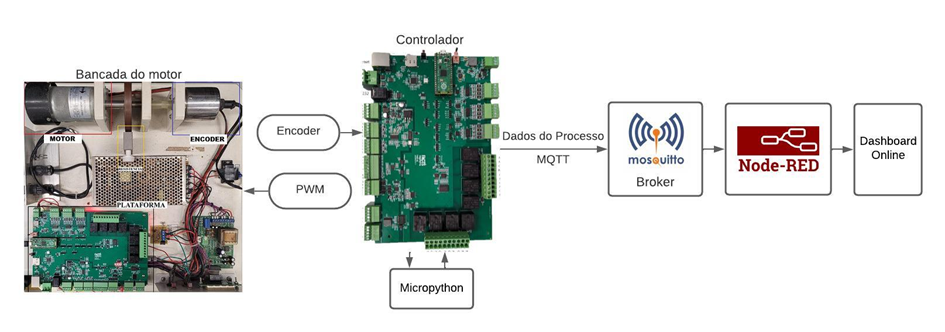

# Open-Source-PLC - Micropython Validation

To validate the applicability of MicroPython on the developed platform, a detailed test scenario was structured, designed to evaluate the system's capabilities in industrial process control. The experiment involves the implementation of a PID speed control, demonstrating the platform's capabilities in applications that require precision and dynamic response.

A video of the experiment can be found at: https://youtu.be/rbEFqCIbv0c?si=TKTA0UZk-yRIU58f